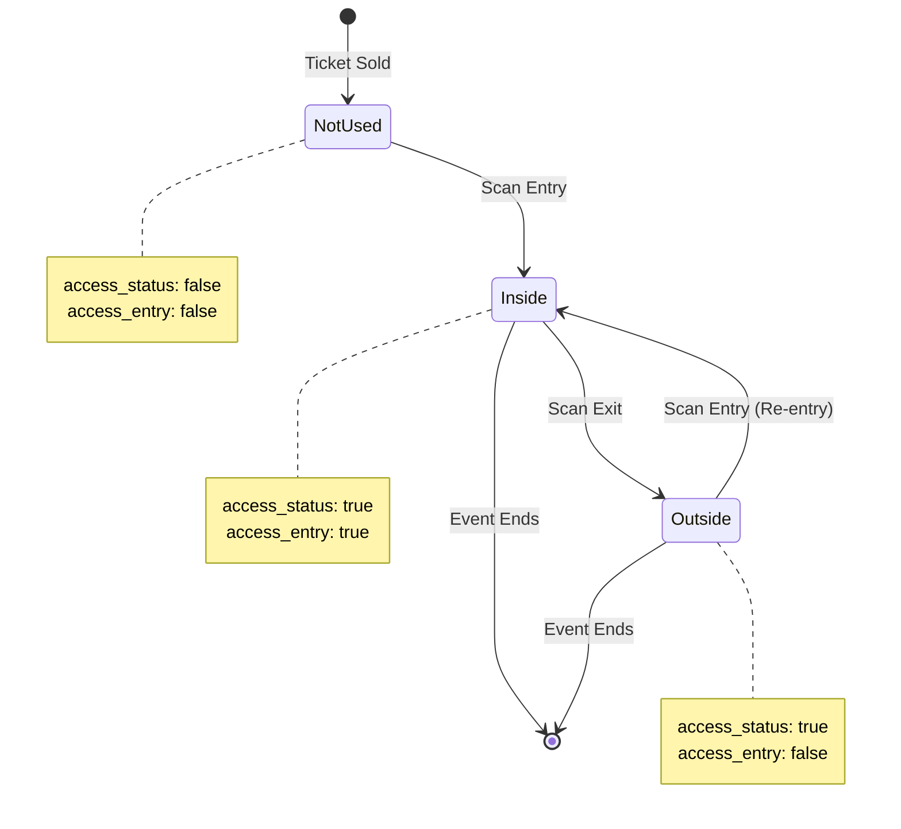

## Overview

The access control endpoints manage ticket scanning for event entry and exit. They track whether attendees are currently inside or outside the venue and maintain a complete ledger of access events.

## Entry Endpoint

### tickets_access_control_in

Scans a ticket for venue entry.

**API:** `POST https://us-central1-[project-id].cloudfunctions.net/tickets_access_control_in`

### Request

<ParamField body="data" type="object" required>
  Request data object
  
  <ParamField body="data.ticket_id" type="string" required>
    The unique ticket identifier to scan
  </ParamField>
</ParamField>

### Response

<ResponseField name="message" type="string">
  Response message describing the result
</ResponseField>

<ResponseField name="status" type="number">
  HTTP status code (200 for success, 400 for error)
</ResponseField>

<ResponseField name="data" type="object">
  Response data object
  
  <ResponseField name="data.valido" type="boolean">
    Indicates if the entry was successful
  </ResponseField>
  
  <ResponseField name="data.message" type="string">
    Human-readable status message
  </ResponseField>
</ResponseField>

### Entry States

The endpoint handles three entry scenarios:

<ResponseField name="First Entry" type="scenario">
  **Conditions:** `access_status = false` AND `access_entry = false`
  
  **Action:** Sets both flags to `true`, adds "accessed" ledger entry
  
  **Response:** "Ticket Ingresando" (Ticket Entering)
</ResponseField>

<ResponseField name="Re-Entry" type="scenario">
  **Conditions:** `access_status = true` AND `access_entry = false`
  
  **Action:** Sets `access_entry = true` only
  
  **Response:** "Ticket ReIngreso" (Ticket Re-Entry)
</ResponseField>

<ResponseField name="Already Inside" type="scenario">
  **Conditions:** `access_status = true` AND `access_entry = true`
  
  **Action:** No changes made
  
  **Response:** "Ticket ya Utilizado no puede volver Ingresar" (Ticket already used, cannot re-enter)
  
  **Status:** 400 (Error)
</ResponseField>

---

## Exit Endpoint

### tickets_access_control_out

Scans a ticket for venue exit.

**API:** `POST https://us-central1-[project-id].cloudfunctions.net/tickets_access_control_out`

### Request

<ParamField body="data" type="object" required>
  Request data object
  
  <ParamField body="data.ticket_id" type="string" required>
    The unique ticket identifier to scan
  </ParamField>
</ParamField>

### Response

<ResponseField name="message" type="string">
  Response message describing the result
</ResponseField>

<ResponseField name="status" type="number">
  HTTP status code (200 for success, 400 for error)
</ResponseField>

<ResponseField name="data" type="object">
  Response data object
  
  <ResponseField name="data.valido" type="boolean">
    Indicates if the exit was successful
  </ResponseField>
  
  <ResponseField name="data.message" type="string">
    Human-readable status message
  </ResponseField>
</ResponseField>

### Exit States

The endpoint handles two exit scenarios:

<ResponseField name="Valid Exit" type="scenario">
  **Conditions:** `access_status = true` AND `access_entry = true`
  
  **Action:** Sets `access_entry = false`, adds "came-out" ledger entry
  
  **Response:** "Ticket Salida" (Ticket Exit)
</ResponseField>

<ResponseField name="Cannot Exit" type="scenario">
  **Conditions:** `access_status = false` AND `access_entry = false`
  
  **Action:** No changes made
  
  **Response:** "Ticket no Ingreso no puede salir" (Ticket never entered, cannot exit)
  
  **Status:** 400 (Error)
</ResponseField>

---

## Access Status Flags

<ResponseField name="access_status" type="boolean">
  Indicates if the ticket has ever been used for entry
  - `false` - Never scanned for entry
  - `true` - Has been scanned at least once
  
  This flag is set to `true` on first entry and never reset.
</ResponseField>

<ResponseField name="access_entry" type="boolean">
  Current location status of the ticket holder
  - `false` - Currently outside the venue
  - `true` - Currently inside the venue
  
  This flag toggles with each entry/exit scan.
</ResponseField>

<ResponseField name="status" type="boolean">
  Ticket sale status
  - `true` - Available for purchase
  - `false` - Sold (required for access control)
  
  Only sold tickets can be used for entry.
</ResponseField>

---

## Offline Sync Endpoint

### tickets_access_control_cold

Synchronizes offline scans with the database.

**API:** `POST https://us-central1-[project-id].cloudfunctions.net/tickets_access_control_cold`

### Request

<ParamField body="data" type="object" required>
  Request data object
  
  <ParamField body="data.tickets_cold" type="array" required>
    Array of offline scan events
    
    <ParamField body="tickets_cold[].ticket_id" type="string" required>
      Ticket identifier
    </ParamField>
    
    <ParamField body="tickets_cold[].date" type="timestamp" required>
      When the scan occurred
    </ParamField>
    
    <ParamField body="tickets_cold[].tipo" type="string" required>
      Scan type: "in" or "out"
    </ParamField>
  </ParamField>
</ParamField>

### Response

<ResponseField name="message" type="string">
  "Tickets Frios Sincronizados" (Cold tickets synchronized)
</ResponseField>

<ResponseField name="status" type="number">
  200 on success
</ResponseField>

<ResponseField name="data" type="object">
  <ResponseField name="data.valido" type="boolean">
    Always `true` on success
  </ResponseField>
  
  <ResponseField name="data.message" type="string">
    Confirmation message
  </ResponseField>
</ResponseField>

### Notes on Offline Sync

- Processes multiple scans for the same ticket in chronological order
- Final state is determined by the last scan event
- Updates both Firestore and PostgreSQL databases
- Deduplicates tickets to avoid processing the same ticket multiple times

---

## List Tickets for Access Control

### tickets_list_access_control

Retrieves all sold tickets for an event.

**API:** `POST https://us-central1-[project-id].cloudfunctions.net/tickets_list_access_control`

### Request

<ParamField body="data" type="object" required>
  <ParamField body="data.event_id" type="string" required>
    Event identifier
  </ParamField>
</ParamField>

### Response

Returns all tickets where `status = false` (sold tickets only).

---

## Code Examples

<CodeGroup>

```bash cURL - Entry
curl -X POST https://us-central1-[project-id].cloudfunctions.net/tickets_access_control_in \
  -H "Content-Type: application/json" \
  -d '{
    "data": {
      "ticket_id": "ABC123XYZ-ticket001"
    }
  }'
```

```bash cURL - Exit
curl -X POST https://us-central1-[project-id].cloudfunctions.net/tickets_access_control_out \
  -H "Content-Type: application/json" \
  -d '{
    "data": {
      "ticket_id": "ABC123XYZ-ticket001"
    }
  }'
```

```javascript JavaScript - Entry Scanner
const scanTicketEntry = async (ticketId) => {
  const response = await fetch(
    'https://us-central1-[project-id].cloudfunctions.net/tickets_access_control_in',
    {
      method: 'POST',
      headers: {
        'Content-Type': 'application/json',
      },
      body: JSON.stringify({
        data: {
          ticket_id: ticketId
        }
      })
    }
  );
  
  const result = await response.json();
  return result;
};

// Usage with QR scanner
const handleQRScan = async (scannedData) => {
  try {
    const result = await scanTicketEntry(scannedData);
    
    if (result.data.valido) {
      // Green light - allow entry
      showSuccess(result.data.message);
      playSuccessSound();
    } else {
      // Red light - deny entry
      showError(result.data.message);
      playErrorSound();
    }
  } catch (error) {
    showError('Error scanning ticket');
    console.error(error);
  }
};
```

```javascript JavaScript - Offline Sync
const syncOfflineScans = async (offlineScans) => {
  const response = await fetch(
    'https://us-central1-[project-id].cloudfunctions.net/tickets_access_control_cold',
    {
      method: 'POST',
      headers: {
        'Content-Type': 'application/json',
      },
      body: JSON.stringify({
        data: {
          tickets_cold: offlineScans
        }
      })
    }
  );
  
  return await response.json();
};

// Usage
const offlineQueue = [
  {
    ticket_id: 'ABC123XYZ-ticket001',
    date: new Date('2024-07-15T18:15:00Z'),
    tipo: 'in'
  },
  {
    ticket_id: 'ABC123XYZ-ticket002',
    date: new Date('2024-07-15T18:16:00Z'),
    tipo: 'in'
  },
  {
    ticket_id: 'ABC123XYZ-ticket001',
    date: new Date('2024-07-15T22:30:00Z'),
    tipo: 'out'
  }
];

syncOfflineScans(offlineQueue)
  .then(result => console.log('Sync completed:', result))
  .catch(error => console.error('Sync failed:', error));
```

```javascript React - Access Control Scanner
import { useState } from 'react';
import QRScanner from 'react-qr-scanner';

function AccessControlScanner({ mode = 'in' }) {
  const [scanResult, setScanResult] = useState(null);
  const [scanning, setScanning] = useState(false);
  
  const handleScan = async (data) => {
    if (data && !scanning) {
      setScanning(true);
      
      const endpoint = mode === 'in'
        ? 'tickets_access_control_in'
        : 'tickets_access_control_out';
      
      try {
        const response = await fetch(
          `https://us-central1-[project-id].cloudfunctions.net/${endpoint}`,
          {
            method: 'POST',
            headers: { 'Content-Type': 'application/json' },
            body: JSON.stringify({
              data: { ticket_id: data.text }
            })
          }
        );
        
        const result = await response.json();
        setScanResult(result);
        
        // Reset after 2 seconds
        setTimeout(() => {
          setScanResult(null);
          setScanning(false);
        }, 2000);
      } catch (error) {
        console.error('Scan error:', error);
        setScanning(false);
      }
    }
  };
  
  const handleError = (error) => {
    console.error('Scanner error:', error);
  };
  
  return (
    <div className="scanner-container">
      <h2>{mode === 'in' ? 'Entry' : 'Exit'} Scanner</h2>
      
      <QRScanner
        delay={300}
        onError={handleError}
        onScan={handleScan}
        style={{ width: '100%' }}
      />
      
      {scanResult && (
        <div className={`result ${scanResult.data.valido ? 'success' : 'error'}`}>
          <p>{scanResult.data.message}</p>
        </div>
      )}
    </div>
  );
}
```

</CodeGroup>

## Example Responses

### Entry - First Time

```json
{
  "message": "Ticket Ingresando",
  "status": 200,
  "data": {
    "valido": true,
    "message": "Ticket Ingresando"
  }
}
```

### Entry - Re-Entry

```json
{
  "message": "Ticket ReIngreso",
  "status": 200,
  "data": {
    "valido": true,
    "message": "Ticket ReIngreso"
  }
}
```

### Entry - Already Inside

```json
{
  "message": "Ticket ya Utilizado no puede volver Ingresar",
  "status": 400,
  "data": {
    "valido": false,
    "message": "Ticket ya Utilizado no puede volver Ingresar"
  }
}
```

### Exit - Success

```json
{
  "message": "Ticket Salida",
  "status": 200,
  "data": {
    "valido": true,
    "message": "Ticket Salida"
  }
}
```

### Exit - Never Entered

```json
{
  "message": "Ticket no Ingreso no puede salir",
  "status": 400,
  "data": {
    "valido": false,
    "message": "Ticket no Ingreso no puede salir"
  }
}
```

### Invalid Ticket

```json
{
  "message": "Ticket no valido",
  "status": 400,
  "data": {
    "valido": false,
    "message": "Ticket no valido"
  }
}
```

### Offline Sync Success

```json
{
  "message": "Tickets Frios Sincronizados",
  "status": 200,
  "data": {
    "valido": true,
    "message": "Tickets Frios Sincronizados"
  }
}
```

## Ledger Actions for Access Control

<ResponseField name="accessed" type="action">
  Added when ticket is scanned for entry
</ResponseField>

<ResponseField name="came-out" type="action">
  Added when ticket is scanned for exit
</ResponseField>

## Access Control Flow



## Best Practices

1. **Visual Feedback** - Show clear green/red indicators based on `valido` flag
2. **Audio Feedback** - Play different sounds for success/error
3. **Offline Support** - Queue scans locally when network unavailable, sync later
4. **Fast Scanning** - The endpoint is optimized for quick response times
5. **Error Handling** - Display the `message` field to staff for troubleshooting
6. **Audit Trail** - All scans are recorded in the ledger for security
7. **Re-entry Policy** - The system supports unlimited re-entries by default

## Integration with Hardware Scanners

```javascript
class TicketScanner {
  constructor(scannerDevice, mode = 'in') {
    this.scanner = scannerDevice;
    this.mode = mode;
    this.offlineQueue = [];
    
    this.scanner.on('scan', this.handleScan.bind(this));
  }
  
  async handleScan(ticketId) {
    const endpoint = this.mode === 'in'
      ? 'tickets_access_control_in'
      : 'tickets_access_control_out';
    
    try {
      const result = await this.scanTicket(endpoint, ticketId);
      this.showResult(result);
    } catch (error) {
      // Network error - queue for offline sync
      this.offlineQueue.push({
        ticket_id: ticketId,
        date: new Date(),
        tipo: this.mode
      });
      
      this.showOfflineMode();
    }
  }
  
  async scanTicket(endpoint, ticketId) {
    const response = await fetch(
      `https://us-central1-[project-id].cloudfunctions.net/${endpoint}`,
      {
        method: 'POST',
        headers: { 'Content-Type': 'application/json' },
        body: JSON.stringify({ data: { ticket_id: ticketId } })
      }
    );
    
    return await response.json();
  }
  
  async syncOffline() {
    if (this.offlineQueue.length === 0) return;
    
    try {
      await syncOfflineScans(this.offlineQueue);
      this.offlineQueue = [];
      this.showOnlineMode();
    } catch (error) {
      console.error('Sync failed:', error);
    }
  }
  
  showResult(result) {
    // Update UI, play sound, etc.
    const status = result.data.valido ? 'success' : 'error';
    this.display.show(status, result.data.message);
  }
}
```

## Notes

- Only sold tickets (`status = false`) can be scanned
- The system tracks both lifetime usage (`access_status`) and current location (`access_entry`)
- Entry/exit scans update both Firestore and PostgreSQL for redundancy
- Offline scanning is supported via the cold sync endpoint
- All access events are recorded in the ticket ledger
- The system prevents re-entry while already inside (requires exit scan first)