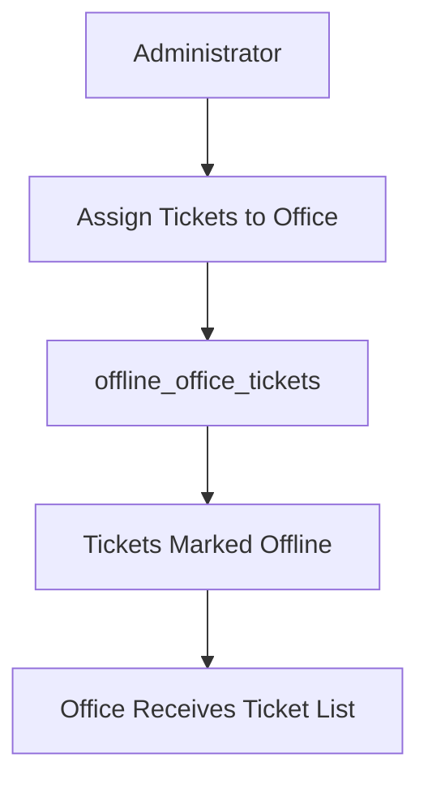
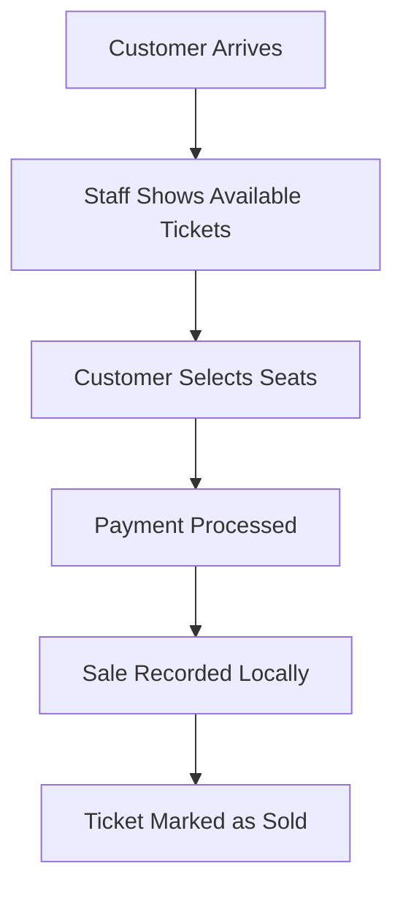
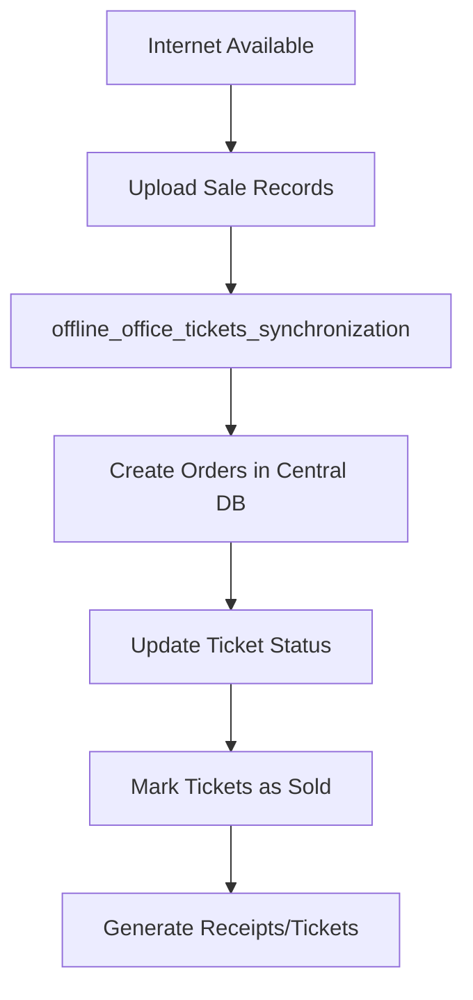

## Overview

The Offline Office system enables box offices to operate without constant internet connectivity. Tickets are pre-assigned to specific offices, sales are recorded locally, and then synchronized with the central system when connectivity is restored. This prevents overselling while allowing uninterrupted operations.

## Office Type: Offline

Offline offices are designed for:
- **Limited connectivity**: Can operate without internet
- **Pre-allocated inventory**: Tickets assigned in advance
- **Local sales recording**: Transactions stored locally
- **Periodic synchronization**: Batch updates to central database
- **Conflict prevention**: Pre-allocation prevents overselling

### Comparison with Virtual Office

| Feature | Offline Office | [Virtual Office](/api/offices/virtual-office) |
|---------|----------------|------------------------------------------------|
| Connectivity | Optional | Required |
| Ticket Assignment | Pre-allocated | Real-time |
| Sale Recording | Local then sync | Immediate |
| Inventory Check | Pre-assigned pool | Live database |
| Use Case | Box office, events | Online sales |

---

## Assign Tickets to Offline Office

### Endpoint
`POST /offline_office_tickets`

### Description
Assign tickets to an offline office for local sales. Tickets are marked as `status_offline: true` and cannot be sold through other channels until unassigned or sold.

### Request

<ParamField body="tickets_offline" type="array" required>
  Array of ticket IDs to assign to the office.
</ParamField>

<ParamField body="office_id" type="string" required>
  The unique identifier of the offline office.
</ParamField>

<ParamField body="event_id" type="string" required>
  The event ID associated with the tickets.
</ParamField>

### Response

<ResponseField name="message" type="string">
  Status message:
  - "Tickets Tranferido offline" - Successfully assigned
  - "Tickets no disponibles" - Some tickets unavailable
</ResponseField>

<ResponseField name="status" type="number">
  HTTP status code (200 on success, 400 if unavailable)
</ResponseField>

<ResponseField name="data" type="object">
  <ResponseField name="valido" type="boolean">
    Indicates if assignment was successful.
  </ResponseField>
  
  <ResponseField name="tickets" type="array">
    Array of ticket IDs that were assigned.
  </ResponseField>
  
  <ResponseField name="nodisponible" type="array">
    Array of ticket IDs that were unavailable (if any).
  </ResponseField>
</ResponseField>

### Validation Checks

Before assignment, the system validates:
1. **Ticket availability**: `status` must be `true`
2. **Not already offline**: `status_offline` must be `false`
3. **Not locked**: Ticket must not exist in `tickets_blocked` table

### Example Request

```json
{
  "data": {
    "tickets_offline": [
      "event-2026-001",
      "event-2026-002",
      "event-2026-003"
    ],
    "office_id": "box-office-stadium-a",
    "event_id": "event-2026-concert"
  }
}
```

### Example Response (Success)

```json
{
  "message": "Tickets Tranferido offline",
  "status": 200,
  "data": {
    "valido": true,
    "tickets": [
      "event-2026-001",
      "event-2026-002",
      "event-2026-003"
    ]
  }
}
```

### Example Response (Some Unavailable)

```json
{
  "message": "Tickets no disponibles",
  "status": 400,
  "data": {
    "valido": false,
    "nodisponible": [
      "event-2026-002"
    ]
  }
}
```

### Ledger Update

Each assigned ticket's ledger is updated:
```json
{
  "date": "2026-03-13T10:30:00Z",
  "action": "offline",
  "metadata": "{}"
}
```

---

## List Tickets for Offline Office

### Endpoint
`POST /offline_office_tickets_list_sales`

### Description
Retrieve all tickets currently assigned to a specific offline office.

### Request

<ParamField body="event_id" type="string" required>
  The event ID to query.
</ParamField>

<ParamField body="office_id" type="string" required>
  The offline office ID.
</ParamField>

### Response

<ResponseField name="message" type="string">
  Status message:
  - "Tickets Encontrado para la Taquilla Offline" - Tickets found
  - "Tickets no Encontrado para la Taquilla Offline" - No tickets found
</ResponseField>

<ResponseField name="status" type="number">
  HTTP status code (200 on success, 400 if not found)
</ResponseField>

<ResponseField name="data" type="object">
  <ResponseField name="valido" type="boolean">
    Indicates if tickets were found.
  </ResponseField>
  
  <ResponseField name="response" type="array">
    Array of ticket objects including:
    - All ticket details (seat, zone, color, etc.)
    - `status`: Computed availability
    - `status_offline`: True (assigned to this office)
    - `ledger`: Transaction history
  </ResponseField>
</ResponseField>

### Example Request

```json
{
  "data": {
    "event_id": "event-2026-concert",
    "office_id": "box-office-stadium-a"
  }
}
```

### Example Response

```json
{
  "message": "Tickets Encontrado para la Taquilla Offline",
  "status": 200,
  "data": {
    "valido": true,
    "response": [
      {
        "id": "event-2026-001",
        "ticket_id": "event-2026-001",
        "event_id": "event-2026-concert",
        "event_name": "Summer Concert 2026",
        "seat_id": "A-1",
        "seat_row": "A",
        "zone": "VIP",
        "color": "#FFD700",
        "status": true,
        "status_offline": true,
        "ledger": [
          {
            "date": "2026-03-13T10:30:00Z",
            "action": "offline",
            "metadata": "{}"
          }
        ]
      }
    ]
  }
}
```

---

## Unassign Tickets from Offline Office

### Endpoint
`POST /offline_office_tickets_unassign`

### Description
Return tickets from an offline office back to the general inventory. Useful when tickets weren't sold or need to be redistributed.

### Request

<ParamField body="tickets_offline" type="array" required>
  Array of ticket IDs to unassign.
</ParamField>

<ParamField body="office_id" type="string" required>
  The offline office ID.
</ParamField>

<ParamField body="event_id" type="string" required>
  The event ID.
</ParamField>

### Response

<ResponseField name="message" type="string">
  Status message: "Tickets Tranferido online"
</ResponseField>

<ResponseField name="status" type="number">
  HTTP status code (200 on success)
</ResponseField>

<ResponseField name="data" type="object">
  <ResponseField name="valido" type="boolean">
    Always `true` on success.
  </ResponseField>
  
  <ResponseField name="tickets" type="array">
    Array of ticket IDs that were unassigned.
  </ResponseField>
</ResponseField>

### Example Request

```json
{
  "data": {
    "tickets_offline": [
      "event-2026-001",
      "event-2026-003"
    ],
    "office_id": "box-office-stadium-a",
    "event_id": "event-2026-concert"
  }
}
```

### Example Response

```json
{
  "message": "Tickets Tranferido online",
  "status": 200,
  "data": {
    "valido": true,
    "tickets": [
      "event-2026-001",
      "event-2026-003"
    ]
  }
}
```

### Operations Performed

1. Sets `status_offline` to `false` in PostgreSQL
2. Updates Firestore ticket documents
3. Removes entries from `tickets_offline` table
4. Appends "unassign" action to ledger

---

## List All Tickets with Offline Status

### Endpoint
`POST /offline_tickets_list_event_sales`

### Description
Retrieve all tickets for an event, including their offline assignment status. Useful for administrators to see the complete ticket distribution.

### Request

<ParamField body="event_id" type="string" required>
  The event ID to query.
</ParamField>

### Response

<ResponseField name="message" type="string">
  Status message indicating result.
</ResponseField>

<ResponseField name="status" type="number">
  HTTP status code (200 on success, 400 if not found)
</ResponseField>

<ResponseField name="data" type="object">
  <ResponseField name="response" type="array">
    Array of all tickets with:
    - `status`: Computed availability (considers locks)
    - `status_offline`: Whether assigned to an offline office
    - `status_real`: Actual database status
    - All standard ticket fields
  </ResponseField>
</ResponseField>

### Example Response

```json
{
  "message": "Evento Encontrado",
  "status": 200,
  "data": {
    "valido": true,
    "response": [
      {
        "ticket_id": "event-2026-001",
        "seat_id": "A-1",
        "status": false,
        "status_offline": true,
        "status_real": true
      },
      {
        "ticket_id": "event-2026-002",
        "seat_id": "A-2",
        "status": true,
        "status_offline": false,
        "status_real": true
      }
    ]
  }
}
```

---

## Synchronize Offline Sales

### Endpoint
`POST /offline_office_tickets_synchronization`

### Description
Synchronize sold tickets from offline office to the central system. This endpoint processes local sale records and creates corresponding orders in the main database.

**Note**: This endpoint is under development and not fully implemented.

### Request

<ParamField body="ticket_sold" type="array" required>
  Array of sale objects, each containing:
  - `ticket`: Ticket ID
  - `transactions`: Payment transaction details
  - `amount`: Sale amount
  - `event_id`: Event identifier
  - `event_name`: Event name
  - `office_id`: Office identifier
  - `office_name`: Office name
  - `status`: Sale status
  - `tickets`: Array of ticket details
  - `client_id`: Customer identifier
  - `client_name`: Customer name
</ParamField>

### Response

<ResponseField name="message" type="string">
  Status message: "Sincronizado" on success.
</ResponseField>

<ResponseField name="status" type="number">
  HTTP status code (200 on success)
</ResponseField>

<ResponseField name="data" type="object">
  <ResponseField name="valido" type="boolean">
    Indicates if synchronization was successful.
  </ResponseField>
</ResponseField>

### Implementation Note

This endpoint calls the `order_created` cloud function to create orders for each synchronized sale:

```javascript
const create_order_sync = httpsCallable(funciones, 'order_created');
await create_order_sync({
  transactions: item.transactions,
  amount: item.amount,
  event_id: item.event_id,
  event_name: item.event_name,
  office_id: item.office_id,
  office_name: item.office_name,
  status: item.status,
  tickets: item.tickets,
  client_id: item.client_id,
  client_name: item.client_name
});
```

---

## Offline Office Workflow

### Initial Setup (With Internet)



### Offline Sales (No Internet Required)



### Synchronization (Internet Restored)



---

## Data Synchronization Strategy

### Local Storage Requirements

Offline offices should store locally:
- Assigned ticket list with all details
- Sales transactions (pending sync)
- Payment information
- Customer details
- Timestamp of last sync

### Sync Conflict Resolution

1. **No conflicts**: Tickets are pre-assigned exclusively
2. **Double assignment**: System prevents via `status_offline` flag
3. **Network issues**: Queue sales for retry
4. **Partial sync**: Track synchronized vs pending sales

### Best Practices

```javascript
// Local storage structure
const officeData = {
  office_id: "box-office-stadium-a",
  event_id: "event-2026-concert",
  assigned_tickets: [...],  // From offline_office_tickets_list_sales
  pending_sales: [...],      // Sales awaiting sync
  last_sync: "2026-03-13T10:00:00Z"
};

// Periodic sync attempt
setInterval(async () => {
  if (navigator.onLine && officeData.pending_sales.length > 0) {
    await syncSales(officeData.pending_sales);
  }
}, 60000); // Every minute
```

---

## Database Schema

### Tickets Offline Table

```sql
CREATE TABLE tickets_offline (
  ticket_id VARCHAR PRIMARY KEY,
  date_created TIMESTAMP,
  event_id VARCHAR,
  office_id VARCHAR,
  FOREIGN KEY (ticket_id) REFERENCES tickets(id)
);
```

### Ticket Status Update

```sql
-- When assigning to offline office
UPDATE tickets 
SET 
  status_offline = true,
  date_updated = NOW(),
  ledger = ledger || '{"date": "...", "action": "offline", "metadata": "{}"}'::jsonb
WHERE ticket_id = $1;
```

---

## Implementation Details

- **Dual database update**: Both PostgreSQL and Firestore
- **Batch operations**: Uses Firestore batch writes for performance
- **Ledger tracking**: Every action is recorded in ticket history
- **CORS enabled**: For web-based office applications
- **Moment.js**: Consistent timestamp formatting

## Error Handling

Handle these scenarios:

1. **Tickets already offline**: Show which office has them
2. **Tickets sold before assignment**: Prevent assignment
3. **Network timeout during sync**: Queue for retry
4. **Partial batch failure**: Rollback and retry
5. **Duplicate sync attempts**: Use idempotency keys

## Security Considerations

- Validate office permissions before assignment
- Encrypt local sale data
- Implement PIN authentication for offline operations
- Audit all synchronization attempts
- Prevent reassignment of sold tickets

## Performance Optimization

- Assign tickets in batches (50-100 at a time)
- Use database indexes on `office_id` and `event_id`
- Compress sync data for faster uploads
- Implement incremental sync (only changed records)
- Cache assigned ticket lists locally

## Related Endpoints

- [Virtual Office](/api/offices/virtual-office) - Online ticket sales
- [Office Validation](/api/offices/office-validate) - Access control
- [Create Event](/api/seatsio/create-event) - Event creation

## Source Reference

Implementation: `/home/daytona/workspace/source/functions/events/offline_office/offline_office.js`