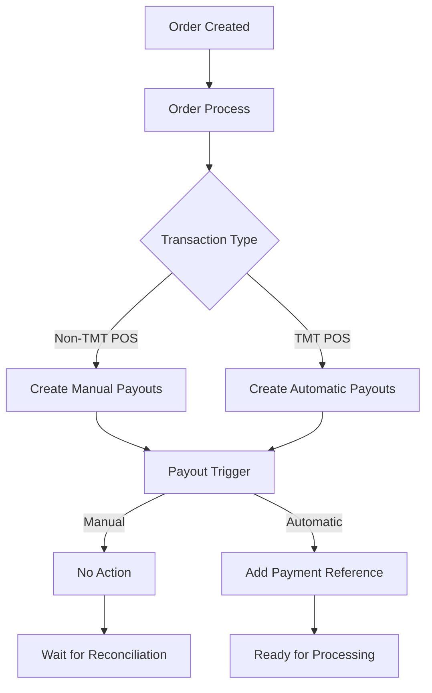

## Overview

The `order_payout` function is a Firestore trigger that automatically executes when a new payout document is created in the `orders_payout` collection. It handles payment reference generation for automatic payouts.

<Warning>
  This is an automatic background process. Do not call this function directly.
</Warning>

## Trigger Behavior

When a payout document is created:

1. **Check Payout Type** - If `payout_type` is "Manual", no action is taken
2. **Generate Reference** - For non-manual payouts, creates a payment reference
3. **Update Document** - Adds payment reference to the payout document

## Payout Document Structure

<ParamField path="amount" type="number">
  Payout amount
</ParamField>

<ParamField path="custody_account" type="object">
  Account receiving the payout
  
  <ParamField path="id" type="string">
    Account ID
  </ParamField>
  
  <ParamField path="name" type="string">
    Account name
  </ParamField>
  
  <ParamField path="account_number" type="string">
    Account number
  </ParamField>
</ParamField>

<ParamField path="date" type="object">
  Date information
  
  <ParamField path="created" type="timestamp">
    Creation timestamp
  </ParamField>
  
  <ParamField path="payout" type="timestamp">
    Payout execution timestamp (empty initially)
  </ParamField>
</ParamField>

<ParamField path="description" type="string">
  Payout description
  - "Pago Costo Fijo" - Fixed cost payment
  - "Pago Costo Variable" - Variable cost payment
</ParamField>

<ParamField path="entity" type="string">
  Entity receiving the payment
  - "TMT" - Platform
  - "Cliente" - Event organizer
</ParamField>

<ParamField path="event_id" type="string">
  Associated event identifier
</ParamField>

<ParamField path="event_name" type="string">
  Event name
</ParamField>

<ParamField path="order_id" type="string">
  Associated order identifier
</ParamField>

<ParamField path="payment_id" type="string">
  Original payment method ID
</ParamField>

<ParamField path="payment_name" type="string">
  Payment method name
</ParamField>

<ParamField path="payout_status" type="boolean">
  Whether payout has been completed (false by default)
</ParamField>

<ParamField path="payout_type" type="string">
  Type of payout processing
  - "Manual" - Requires manual processing
  - "Automatic" - Processed automatically
</ParamField>

<ParamField path="client_id" type="string">
  Client identifier
</ParamField>

<ParamField path="client_name" type="string">
  Client name
</ParamField>

<ParamField path="amount_exchange" type="number">
  Amount in exchange currency
</ParamField>

<ParamField path="amount_currency" type="string">
  Currency code (USD, VEF, etc.)
</ParamField>

<ParamField path="amount_exchange_rate" type="number">
  Exchange rate applied
</ParamField>

<ParamField path="payment_data" type="object">
  Original payment transaction data
</ParamField>

## Payment Reference Structure

For non-manual payouts, the function adds a `payment_reference` object:

<ResponseField name="payment_reference" type="object">
  Payment reference information
  
  <ResponseField name="amount" type="number">
    Reference amount
  </ResponseField>
  
  <ResponseField name="date" type="timestamp">
    Reference creation date
  </ResponseField>
  
  <ResponseField name="document" type="string">
    Document identifier (empty by default)
  </ResponseField>
  
  <ResponseField name="reference" type="string">
    Payment reference number
  </ResponseField>
</ResponseField>

## Code Examples

<CodeGroup>

```javascript Query Payouts by Order
// Get all payouts for a specific order
const getOrderPayouts = async (orderId) => {
  const payoutsRef = db.collection('orders_payout');
  const snapshot = await payoutsRef
    .where('order_id', '==', orderId)
    .get();
  
  const payouts = [];
  snapshot.forEach(doc => {
    payouts.push({
      id: doc.id,
      ...doc.data()
    });
  });
  
  return payouts;
};

// Example usage
const payouts = await getOrderPayouts('order_123');
payouts.forEach(payout => {
  console.log(`${payout.entity}: $${payout.amount}`);
  console.log(`Status: ${payout.payout_status ? 'Paid' : 'Pending'}`);
  console.log(`Type: ${payout.payout_type}`);
});
```

```javascript Check Payout Status
// Monitor payout completion for an event
const checkEventPayoutStatus = async (eventId) => {
  const payoutsRef = db.collection('orders_payout');
  const snapshot = await payoutsRef
    .where('event_id', '==', eventId)
    .get();
  
  let totalAmount = 0;
  let paidAmount = 0;
  let pendingAmount = 0;
  
  const summary = {
    TMT: { total: 0, paid: 0, pending: 0 },
    Cliente: { total: 0, paid: 0, pending: 0 }
  };
  
  snapshot.forEach(doc => {
    const payout = doc.data();
    const amount = payout.amount;
    const entity = payout.entity;
    
    totalAmount += amount;
    summary[entity].total += amount;
    
    if (payout.payout_status) {
      paidAmount += amount;
      summary[entity].paid += amount;
    } else {
      pendingAmount += amount;
      summary[entity].pending += amount;
    }
  });
  
  return {
    total: totalAmount,
    paid: paidAmount,
    pending: pendingAmount,
    byEntity: summary
  };
};

// Example usage
const status = await checkEventPayoutStatus('evt_123');
console.log('Total payouts:', status.total);
console.log('Paid:', status.paid);
console.log('Pending:', status.pending);
console.log('TMT:', status.byEntity.TMT);
console.log('Cliente:', status.byEntity.Cliente);
```

```bash Query Payouts by Currency
# Get all USD payouts for an event
curl -X POST https://api.tmt.com/query \
  -H "Content-Type: application/json" \
  -d '{
    "collection": "orders_payout",
    "where": [
      ["event_id", "==", "evt_123"],
      ["amount_currency", "==", "USD"],
      ["payout_status", "==", false]
    ]
  }'
```

```javascript Update Payout Status
// This is typically done through the invoice_payout_status endpoint
// Example of how payout status is updated:

const updatePayoutStatus = async (payoutId, referenceNumber) => {
  const payoutRef = db.collection('orders_payout').doc(payoutId);
  
  await payoutRef.update({
    payout_status: true,
    reference_number: referenceNumber,
    'date.payout': admin.firestore.Timestamp.now()
  });
  
  console.log(`Payout ${payoutId} marked as completed`);
};
```

</CodeGroup>

## Payout Types

### Manual Payouts

Manual payouts are created for:
- Non-TMT point of sale transactions
- Standard payment processing

These require manual reconciliation and payment reference assignment.

### Automatic Payouts

Automatic payouts are created for:
- TMT point of sale transactions
- Automated payment systems

These receive automatic payment references when created.

<Warning>
  Manual payouts must be processed through the reconciliation system. Do not manually update payout_status without proper payment verification.
</Warning>

## Payment Distribution Flow



## Related Endpoints

- [Order Process](/api/orders/order-process) - Creates payout records
- [Order Created](/api/orders/order-created) - Initiates order processing
- [Process Order Billing](/api/billing/process-order-billing) - Generate invoices for orders

## Querying Payouts

Common query patterns:

```javascript
// Pending payouts for an event
db.collection('orders_payout')
  .where('event_id', '==', eventId)
  .where('payout_status', '==', false)
  .get();

// TMT fixed cost payouts
db.collection('orders_payout')
  .where('entity', '==', 'TMT')
  .where('description', '==', 'Pago Costo Fijo')
  .get();

// Client variable cost payouts in USD
db.collection('orders_payout')
  .where('entity', '==', 'Cliente')
  .where('amount_currency', '==', 'USD')
  .where('description', '==', 'Pago Costo Variable')
  .get();
```

<Warning>
  Firestore queries require composite indexes for multiple where clauses. Ensure indexes are created before running complex queries.
</Warning>