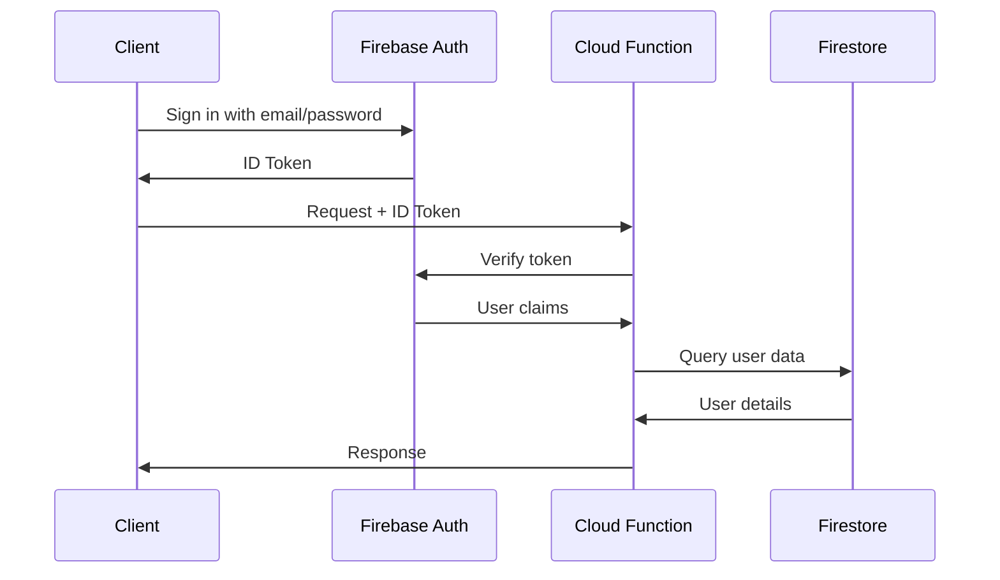
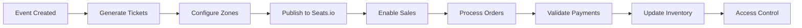

## Overview

TMT API is built on Firebase Cloud Functions, providing a serverless backend for ticket management and event operations. The architecture combines Firebase services with PostgreSQL for transactional consistency and advanced querying.

## Technology Stack

<CardGroup cols={2}>
  <Card title="Firebase Cloud Functions" icon="fire">
    Serverless compute platform for all API endpoints
  </Card>
  <Card title="Firebase Authentication" icon="lock">
    User authentication and authorization
  </Card>
  <Card title="Firestore" icon="database">
    NoSQL database for real-time data and user management
  </Card>
  <Card title="PostgreSQL" icon="server">
    Relational database for transactional data and analytics
  </Card>
</CardGroup>

## System Components

### Cloud Functions Layer

All API endpoints are implemented as Firebase Cloud Functions v2:

```javascript
const functions = require("firebase-functions/v2");
const config = require("./config/config");
const admin = config.admin;
const db = config.db;

exports.tickets_generate = functions.https.onRequest(async (req, res) => {
  cors(req, res, async () => {
    // Function implementation
  });
});
```

<Note>
  All functions use CORS with `origin: "*"` to allow cross-origin requests from web and mobile clients.
</Note>

### Database Architecture

TMT API uses a dual-database architecture:

#### Firestore (Primary)

- **Collections**: `events`, `orders`, `orders_payout`, `u_clients`, `u_collaborators`, `u_staff`, `app_users`
- **Subcollections**: `tickets` (under events), `transactions` (under orders)
- **Real-time**: Live updates for ticket availability and order status
- **Triggers**: Automatic processing via Firestore triggers (onDocumentCreated, onDocumentUpdated)

#### PostgreSQL (Analytics)

- **Tables**: `tickets`, `transactions`, `orders`, `conciliation`
- **Use cases**: Complex queries, reporting, reconciliation
- **Connection**: Cloud SQL Connector for secure access

```javascript
const dbpostgres = require("./config/dbpostgres");
const response = await dbpostgres.sqltmt(
  "insert",
  "tickets",
  campos,
  null,
  null,
  null,
  null,
  valores
);
```

### Authentication Flow



### Event Processing Pipeline



## Integration Points

### Payment Gateways

<Tabs>
  <Tab title="Stripe">
    International payments via Stripe Payment Intents API
    
    ```javascript
    const stripe = require('stripe')(process.env.STRIPE_SECRET_KEY);
    const paymentIntent = await stripe.paymentIntents.create({
      amount: Math.round(amount * 100),
      currency: 'usd'
    });
    ```
  </Tab>
  
  <Tab title="Mercantil">
    Venezuelan bank integration for debit/credit cards and mobile payments
    
    - TDD: Debit card payments
    - TDC: Credit card payments
    - C2P: Card-to-Phone mobile payments
  </Tab>
  
  <Tab title="Banco de Venezuela">
    Mobile payment (Pago Móvil) verification and automated reconciliation
  </Tab>
</Tabs>

### Seats.io Integration

Venue seating and chart management:

```javascript
const { SeatsioClient } = require('seatsio');
const client = new SeatsioClient(process.env.SEATSIO_SECRET_KEY);

await client.events.create({
  chartKey: chartId,
  eventKey: eventId
});
```

### Billing Integration

TFHKA electronic invoicing system for Venezuelan tax compliance:

```javascript
exports.billing_emision = functions.https.onRequest(async (req, res) => {
  // Generate invoice with tax calculations
  // VAT: 16%, IGTF: 3% for foreign currency
});
```

## Data Flow

### Order Processing

1. **Order Creation**: Client creates order via `order_created` endpoint
2. **Payment Validation**: `transactions_validate` checks payment details
3. **Transaction Generation**: `transactions_generate` creates transaction records
4. **Firestore Trigger**: `order_process` automatically processes the order
5. **Ticket Update**: Updates ticket status and assigns to customer
6. **Payout Processing**: `order_payout` distributes funds to accounts
7. **Billing**: `process_order_billing` generates electronic invoice

<Warning>
  All order processing steps must complete successfully. Use Firestore transactions for atomic operations.
</Warning>

## Scalability

### Horizontal Scaling

- Cloud Functions automatically scale based on request volume
- Firestore supports millions of concurrent connections
- PostgreSQL connection pooling via Cloud SQL Connector

### Performance Optimization

```javascript
// Batch writes for ticket generation
var batch = db.batch();
for (let i = 1; i <= zone.seats; i++) {
  var writeTickets = db.collection('events').doc(eventId)
    .collection('tickets').doc(ticketId);
  batch.set(writeTickets, ticketData);
}
await batch.commit();
```

### Caching Strategy

- Exchange rates cached in Firestore with daily updates
- Event data cached on client with real-time sync
- Ticket availability updated via Firestore listeners

## Security

<CardGroup cols={2}>
  <Card title="Firebase Auth" icon="shield">
    Token-based authentication for all API calls
  </Card>
  <Card title="Custom Claims" icon="user-check">
    Role-based access control (client, collaborator, staff)
  </Card>
  <Card title="HTTPS Only" icon="lock">
    All endpoints require TLS encryption
  </Card>
  <Card title="Input Validation" icon="check">
    Request validation before processing
  </Card>
</CardGroup>

## Monitoring

- **Firebase Console**: Function logs and error tracking
- **Cloud Logging**: Structured logging for debugging
- **Performance Monitoring**: Response times and success rates
- **Firestore Dashboard**: Real-time data and query performance

## Related Topics

<CardGroup cols={2}>
  <Card title="Events" icon="calendar" href="/concepts/events">
    Event data model and lifecycle
  </Card>
  <Card title="Tickets" icon="ticket" href="/concepts/tickets">
    Ticket structure and management
  </Card>
  <Card title="Orders" icon="cart-shopping" href="/concepts/orders">
    Order processing workflow
  </Card>
  <Card title="Authentication" icon="key" href="/authentication">
    Authentication setup guide
  </Card>
</CardGroup>
