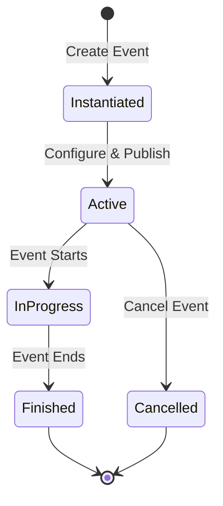

## Overview

Events are the core entity in TMT API, representing concerts, shows, games, or any ticketed occasion. Each event contains configuration for tickets, zones, pricing, and access control.

## Event Data Model

### Event Document Structure

Events are stored in the `events` collection in Firestore:

```javascript
{
  event_id: "evt_abc123",
  event: {
    name: "Summer Music Festival 2026",
    description: "Annual outdoor music festival",
    type: "concert",
    category: "music"
  },
  date_start: Timestamp,
  date_end: Timestamp,
  location: {
    venue: "Central Park Amphitheater",
    city: "New York",
    country: "USA",
    address: "123 Park Ave",
    coordinates: {
      lat: 40.7829,
      lng: -73.9654
    }
  },
  status: "active",
  client_id: "client_xyz789",
  created_at: Timestamp,
  updated_at: Timestamp
}
```

### Zone Configuration

Zones define seating sections with pricing tiers:

```javascript
// Stored in events/{event_id}/setup/zones
{
  status: true,
  seats_allocated: 1500,
  zone: [
    {
      id: "VIP",
      name: "VIP Section",
      description: "Front row seating with premium amenities",
      seats: 100,
      price: 150.00,
      color: "#FFD700",
      currency: "USD"
    },
    {
      id: "GA",
      name: "General Admission",
      description: "Standard seating",
      seats: 1400,
      price: 50.00,
      color: "#4169E1",
      currency: "USD"
    }
  ]
}
```

<Note>
  Total `seats_allocated` must equal the sum of all zone seats. This validation is enforced during ticket generation.
</Note>

## Event Lifecycle



### Status Values

<Accordion title="instantiated">
  Event created but not yet published. Tickets can be generated but not sold.
  
  **Actions available**: Configure zones, generate tickets, set pricing
</Accordion>

<Accordion title="active">
  Event published and tickets available for sale.
  
  **Actions available**: Sell tickets, process orders, manage inventory
</Accordion>

<Accordion title="in_progress">
  Event currently happening. Access control is active.
  
  **Actions available**: Scan tickets, track entry/exit, access control
</Accordion>

<Accordion title="finished">
  Event completed. No more ticket sales or entry.
  
  **Actions available**: View analytics, generate reports, process payouts
</Accordion>

<Accordion title="cancelled">
  Event cancelled. Refunds may be processed.
  
  **Actions available**: Process refunds, notify customers
</Accordion>

## Financial Setup

### Cost Configuration

Events can have fixed and variable costs:

```javascript
// Stored in events/{event_id}/setup/financial
{
  fixed_costs: [
    {
      account_id: "venue_rental",
      amount: 5000.00,
      currency: "USD",
      description: "Venue rental fee"
    },
    {
      account_id: "insurance",
      amount: 1500.00,
      currency: "USD",
      description: "Event insurance"
    }
  ],
  variable_costs: [
    {
      account_id: "artist_payment",
      percentage: 60.0,
      description: "Artist revenue share"
    },
    {
      account_id: "platform_fee",
      percentage: 10.0,
      description: "Platform commission"
    }
  ]
}
```

### Payment Distribution

When orders are processed, the `order_payout` function distributes funds:

1. **Fixed Costs**: Deducted first from gross revenue
2. **Variable Costs**: Calculated as percentage of remaining amount
3. **Net to Client**: Remaining balance after all deductions

<Tip>
  Set up financial configuration before activating the event to ensure proper payment distribution.
</Tip>

## Access Control

### Security PIN

Events can require a PIN code for box office access:

```javascript
// Set PIN via helpers_event_pin function
{
  event_id: "evt_abc123",
  pin: "1234",
  enabled: true
}
```

### Checkpoints

Define entry/exit points for access control:

```javascript
// Stored in events/{event_id}/checkpoints
{
  checkpoint_id: "entrance_1",
  name: "Main Entrance",
  type: "entry",
  location: "North Gate",
  active: true
}
```

## Seating Integration

### Seats.io Charts

Events can use Seats.io for advanced seating:

```javascript
{
  seatsio_config: {
    chart_id: "chart_12345",
    event_key: "evt_abc123",
    use_seating: true
  }
}
```

### Creating Seats.io Event

```javascript
const { create_event_seatsio } = require('./functions/seatsio/seatsio');

const result = await create_event_seatsio({
  chart_id: "chart_12345",
  event_id: "evt_abc123",
  name_event: "Summer Music Festival 2026",
  date_event: "2026-07-15"
});
```

<Note>
  Seats.io integration is optional. Events can use simple zone-based seating without Seats.io.
</Note>

## Event Status Management

### Update Event Status

```javascript
const { update_events_status } = require('./functions/events/helpers/helpers');

await update_events_status({
  event_id: "evt_abc123",
  status: "active"
});
```

### Automatic Status Updates

Status can change automatically based on date/time:

- **active → in_progress**: When `date_start` is reached
- **in_progress → finished**: When `date_end` is reached

<Warning>
  Changing event status affects ticket sales and access control. Always verify the new status before updating.
</Warning>

## Portal Configuration

Events can be displayed on client portals:

```javascript
// List events for a client portal
const { list_events_clients } = require('./functions/portals/portals');

const events = await list_events_clients({
  client_id: "client_xyz789",
  status: "active"
});
```

## Best Practices

<CardGroup cols={2}>
  <Card title="Pre-Event Checklist" icon="list-check">
    - Configure all zones and pricing
    - Generate tickets
    - Set up financial distribution
    - Test payment processing
    - Configure access control
  </Card>
  
  <Card title="During Event" icon="clock">
    - Monitor ticket sales in real-time
    - Track entry/exit via access control
    - Handle customer support requests
    - Monitor system performance
  </Card>
  
  <Card title="Post-Event" icon="flag-checkered">
    - Process final payouts
    - Generate financial reports
    - Collect feedback
    - Archive event data
  </Card>
  
  <Card title="Capacity Management" icon="users">
    - Set realistic seat allocations
    - Monitor sell-through rates
    - Adjust pricing if needed
    - Manage waiting lists
  </Card>
</CardGroup>

## Related Topics

<CardGroup cols={2}>
  <Card title="Ticket Generation" icon="ticket" href="/guides/ticket-generation">
    Generate tickets for your event
  </Card>
  <Card title="Event Setup Guide" icon="wrench" href="/guides/event-setup">
    Step-by-step event configuration
  </Card>
  <Card title="Access Control" icon="door-open" href="/guides/access-control">
    Set up entry/exit tracking
  </Card>
  <Card title="Tickets Concept" icon="book" href="/concepts/tickets">
    Learn about ticket data model
  </Card>
</CardGroup>
