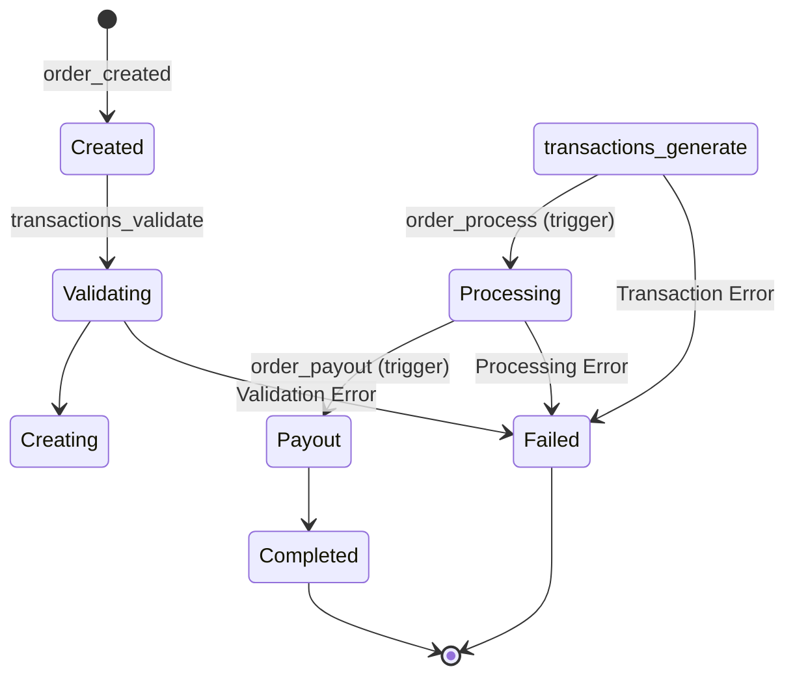
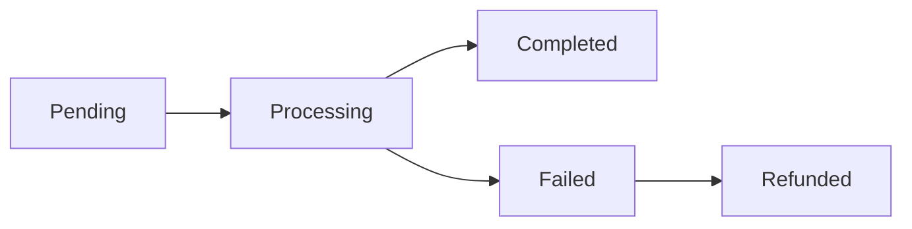

## Overview

Orders represent purchases of one or more tickets. The order lifecycle includes validation, transaction creation, payment processing, ticket assignment, and payout distribution.

## Order Data Model

### Order Structure

Orders are stored in the `orders` collection:

```javascript
{
  order_id: "ord_abc123",
  event_id: "evt_xyz789",
  event_name: "Summer Music Festival 2026",
  
  // Customer information
  customer: {
    name: "John Doe",
    email: "john@example.com",
    phone: "+1234567890",
    id: "user_123",
    id_type: "passport",
    id_number: "AB123456"
  },
  
  // Order items
  tickets: [
    {
      ticket_id: "evt_xyz789-tk_1",
      zone: "VIP",
      seat_id: "VIP-1",
      price: 150.00,
      currency: "USD"
    },
    {
      ticket_id: "evt_xyz789-tk_2",
      zone: "VIP",
      seat_id: "VIP-2",
      price: 150.00,
      currency: "USD"
    }
  ],
  
  // Pricing
  subtotal: 300.00,
  fees: 30.00,
  tax: 48.00,
  total: 378.00,
  currency: "USD",
  
  // Payment information
  payment: {
    method: "stripe",
    payment_intent_id: "pi_abc123",
    status: "succeeded",
    paid_at: Timestamp
  },
  
  // Status tracking
  status: "completed",
  
  // Timestamps
  created_at: Timestamp,
  updated_at: Timestamp,
  processed_at: Timestamp
}
```

## Order Lifecycle



### Order Status Values

<Tabs>
  <Tab title="Created">
    Order document created, awaiting payment validation.
    
    ```javascript
    {
      status: "created",
      created_at: Timestamp
    }
    ```
  </Tab>
  
  <Tab title="Processing">
    Payment validated, tickets being assigned.
    
    ```javascript
    {
      status: "processing",
      payment: {status: "succeeded"},
      processing_started_at: Timestamp
    }
    ```
  </Tab>
  
  <Tab title="Completed">
    Tickets assigned, payouts distributed, invoice generated.
    
    ```javascript
    {
      status: "completed",
      processed_at: Timestamp,
      invoice: {
        invoice_number: "INV-2026-00123",
        generated_at: Timestamp
      }
    }
    ```
  </Tab>
  
  <Tab title="Failed">
    Order processing failed. Tickets remain available.
    
    ```javascript
    {
      status: "failed",
      error: {
        code: "PAYMENT_FAILED",
        message: "Payment declined by issuer",
        timestamp: Timestamp
      }
    }
    ```
  </Tab>
</Tabs>

## Order Processing Flow

### Step 1: Create Order

```javascript
const { order_created } = require('./functions/orders/order');

const result = await order_created({
  event_id: "evt_xyz789",
  customer: {
    name: "John Doe",
    email: "john@example.com",
    phone: "+1234567890",
    id: "user_123"
  },
  tickets: [
    {ticket_id: "evt_xyz789-tk_1", price: 150.00},
    {ticket_id: "evt_xyz789-tk_2", price: 150.00}
  ],
  total: 378.00,
  currency: "USD"
});

// Returns: {order_id: "ord_abc123", status: "created"}
```

### Step 2: Validate Transaction

```javascript
const { transactions_validate } = require('./functions/transactions_validate/transactions_validate');

const validation = await transactions_validate({
  order_id: "ord_abc123",
  amount: 378.00,
  currency: "USD",
  tickets: ["evt_xyz789-tk_1", "evt_xyz789-tk_2"]
});

// Checks:
// - All tickets are still available
// - Amount matches ticket prices + fees
// - No duplicate tickets
// - Tickets belong to the same event
```

<Warning>
  Always validate transactions before processing payment. This prevents selling unavailable tickets.
</Warning>

### Step 3: Generate Transaction

```javascript
const { transactions_generate } = require('./functions/transactions/transactions');

const transaction = await transactions_generate({
  order_id: "ord_abc123",
  event_id: "evt_xyz789",
  customer: {...},
  tickets: [...],
  amount: 378.00,
  currency: "USD",
  payment_method: "stripe",
  payment_data: {
    payment_intent_id: "pi_abc123"
  }
});

// Creates transaction document with:
{
  transaction_id: "txn_def456",
  order_id: "ord_abc123",
  status: "pending",
  amount: 378.00,
  created_at: Timestamp
}
```

### Step 4: Automatic Processing (Firestore Trigger)

The `order_process` trigger automatically runs when an order is created:

```javascript
exports.order_process = onDocumentCreated("orders/{orderId}", async (event) => {
  const orderData = event.data.data();
  
  // 1. Update ticket status to sold
  // 2. Assign customer to tickets
  // 3. Update ticket ledger
  // 4. Write to PostgreSQL for analytics
  // 5. Create payout records
});
```

<Note>
  This trigger runs automatically. Do not call `order_process` directly.
</Note>

### Step 5: Payout Distribution (Firestore Trigger)

The `order_payout` trigger distributes funds when a payout record is created:

```javascript
exports.order_payout = onDocumentCreated("orders_payout/{payoutId}", async (event) => {
  const payout = event.data.data();
  
  // Calculate distribution:
  // 1. Fixed costs (venue, insurance, etc.)
  // 2. Variable costs (artist %, platform fee)
  // 3. Remaining to client
});
```

## Transactions

### Transaction Document Structure

```javascript
// Stored in orders/{order_id}/transactions/{transaction_id}
{
  transaction_id: "txn_def456",
  order_id: "ord_abc123",
  event_id: "evt_xyz789",
  
  // Amount details
  amount: 378.00,
  currency: "USD",
  exchange_rate: 1.0,
  amount_local: 378.00,
  
  // Payment details
  payment_method: "stripe",
  payment_data: {
    payment_intent_id: "pi_abc123",
    charge_id: "ch_xyz789"
  },
  
  // Status
  status: "completed",
  
  // Custody account (for tracking)
  custody_account: "custody_main",
  
  // Timestamps
  created_at: Timestamp,
  completed_at: Timestamp
}
```

### Transaction Status Flow



## Payment Distribution

### Payout Document Structure

```javascript
// Stored in orders_payout collection
{
  payout_id: "pyt_ghi789",
  order_id: "ord_abc123",
  event_id: "evt_xyz789",
  client_id: "client_jkl012",
  
  // Financial breakdown
  gross_amount: 378.00,
  fixed_costs: 50.00,
  variable_costs: 113.40,  // 30% of remaining
  net_amount: 214.60,
  currency: "USD",
  
  // Distribution details
  distributions: [
    {
      account_id: "venue_rental",
      type: "fixed",
      amount: 30.00,
      description: "Venue fee per ticket"
    },
    {
      account_id: "artist_payment",
      type: "variable",
      percentage: 60.0,
      amount: 196.80
    },
    {
      account_id: "platform_fee",
      type: "variable",
      percentage: 10.0,
      amount: 32.80
    }
  ],
  
  // Payment reference
  payment_reference: "PAY-2026-03-15-00123",
  payout_type: "automatic",
  
  // Status
  status: "pending",
  created_at: Timestamp
}
```

### Distribution Calculation

```javascript
// Example calculation for 2 tickets at $150 each
const gross = 300.00;
const fees = 30.00;
const total = 330.00;

// Fixed costs (per ticket or per order)
const fixedCosts = 50.00;
const afterFixed = total - fixedCosts; // 280.00

// Variable costs (percentage of remaining)
const artistShare = afterFixed * 0.60; // 168.00
const platformFee = afterFixed * 0.10; // 28.00
const clientNet = afterFixed - artistShare - platformFee; // 84.00
```

<Tip>
  Configure financial setup before activating events to ensure accurate payout distribution.
</Tip>

## Billing and Invoicing

### Generate Invoice

After order completion, generate an electronic invoice:

```javascript
const { process_order_billing } = require('./functions/billing/billing');

const invoice = await process_order_billing({
  order_id: "ord_abc123"
});

// Creates invoice with:
{
  invoice_number: "INV-2026-00123",
  order_id: "ord_abc123",
  customer: {...},
  items: [...],
  subtotal: 300.00,
  vat: 48.00,    // 16% VAT
  igtf: 9.00,    // 3% IGTF (if foreign currency)
  total: 357.00,
  issued_at: Timestamp
}
```

### Tax Calculations

- **VAT (IVA)**: 16% on subtotal
- **IGTF**: 3% on foreign currency transactions (USD, EUR, etc.)
- **No IGTF**: For local currency (VEF/VES)

<Note>
  Tax rates are configurable per region. Check local regulations for accurate calculations.
</Note>

## Error Handling

### Common Errors

| Error Code | Description | Resolution |
|------------|-------------|------------|
| `TICKET_UNAVAILABLE` | Ticket already sold or locked | Select different tickets |
| `AMOUNT_MISMATCH` | Order total doesn't match | Recalculate and retry |
| `PAYMENT_FAILED` | Payment declined | Try different payment method |
| `DUPLICATE_ORDER` | Order ID already exists | Generate new order ID |
| `EVENT_INACTIVE` | Event not accepting orders | Check event status |

### Rollback Strategy

If order processing fails:

1. **Unlock tickets**: Release any locked tickets
2. **Refund payment**: If payment succeeded
3. **Update order status**: Set to "failed"
4. **Notify customer**: Send error notification
5. **Log error**: For debugging and analytics

<Warning>
  Never manually modify order status after payment succeeds. Use proper refund procedures.
</Warning>

## Best Practices

<CardGroup cols={2}>
  <Card title="Validation First" icon="check-double">
    Always validate before charging payment:
    - Ticket availability
    - Price accuracy
    - Customer information
    - Event status
  </Card>
  
  <Card title="Idempotency" icon="fingerprint">
    Use unique order IDs to prevent duplicates:
    ```javascript
    const orderId = `ord_${Date.now()}_${userId}`;
    ```
  </Card>
  
  <Card title="Atomic Operations" icon="atom">
    Use Firestore transactions for critical updates:
    ```javascript
    await db.runTransaction(async (t) => {
      // Update tickets and order atomically
    });
    ```
  </Card>
  
  <Card title="Audit Trail" icon="list-check">
    Maintain complete order history:
    - Order creation timestamp
    - Payment attempts
    - Processing steps
    - Error logs
  </Card>
</CardGroup>

## Related Topics

<CardGroup cols={2}>
  <Card title="Payment Processing Guide" icon="credit-card" href="/guides/payment-processing">
    Integrate payment gateways
  </Card>
  <Card title="Tickets Concept" icon="ticket" href="/concepts/tickets">
    Understand ticket lifecycle
  </Card>
  <Card title="Events Concept" icon="calendar" href="/concepts/events">
    Event configuration and setup
  </Card>
  <Card title="Order APIs" icon="code" href="/api/orders/order-created">
    Order endpoint reference
  </Card>
</CardGroup>
