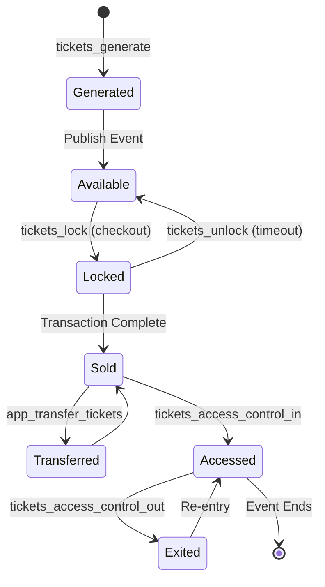

## Overview

Tickets represent individual admissions to events. Each ticket has a unique ID, belongs to a specific zone, tracks its status, and maintains a complete audit trail via a ledger.

## Ticket Data Model

### Ticket Structure

Tickets are stored as subcollections under events:

```javascript
// Firestore path: events/{event_id}/tickets/{ticket_id}
{
  ticket_id: "evt_abc123-tk_xyz456",
  event_id: "evt_abc123",
  event_name: "Summer Music Festival 2026",
  date_start: Timestamp(2026, 6, 15, 18, 0, 0),
  date_end: Timestamp(2026, 6, 15, 23, 0, 0),
  
  // Zone and seating
  zone: "VIP",
  color: "#FFD700",
  seat_id: "VIP-1",
  seat_row: "A",
  
  // Status tracking
  status: true,  // true = available, false = sold
  
  // Customer information (set when sold)
  customer: {
    name: "John Doe",
    email: "john@example.com",
    phone: "+1234567890",
    id: "user_123"
  },
  
  // Pricing
  price: 150.00,
  currency: "USD",
  
  // Timestamps
  date: {
    created: Timestamp,
    updated: Timestamp
  },
  
  // Audit trail
  ledger: [
    {
      date: Timestamp(2026, 3, 1, 10, 0, 0),
      action: "generated",
      metadata: ""
    },
    {
      date: Timestamp(2026, 3, 15, 14, 30, 0),
      action: "sold",
      metadata: {order_id: "ord_xyz", transaction_id: "txn_abc"}
    }
  ]
}
```

## Ticket Lifecycle



### Status Values

<Tabs>
  <Tab title="Available">
    **status**: `true`  
    **ledger action**: `"generated"`
    
    Ticket is available for purchase. No customer information assigned.
    
    ```javascript
    {
      status: true,
      customer: null,
      ledger: [{action: "generated", date: Timestamp}]
    }
    ```
  </Tab>
  
  <Tab title="Locked">
    **status**: `true`  
    **ledger action**: `"locked"`  
    **lock_info**: Present
    
    Ticket temporarily reserved during checkout. Auto-unlocks after timeout.
    
    ```javascript
    {
      status: true,
      lock_info: {
        locked_by: "user_123",
        locked_at: Timestamp,
        expires_at: Timestamp
      },
      ledger: [{action: "locked", date: Timestamp, metadata: {user_id: "user_123"}}]
    }
    ```
  </Tab>
  
  <Tab title="Sold">
    **status**: `false`  
    **ledger action**: `"sold"`  
    **customer**: Present
    
    Ticket purchased and assigned to customer.
    
    ```javascript
    {
      status: false,
      customer: {
        name: "John Doe",
        email: "john@example.com",
        phone: "+1234567890",
        id: "user_123"
      },
      ledger: [
        {action: "generated", date: Timestamp},
        {action: "sold", date: Timestamp, metadata: {order_id: "ord_xyz"}}
      ]
    }
    ```
  </Tab>
  
  <Tab title="Accessed">
    **status**: `false`  
    **ledger action**: `"accessed"`  
    **access_status**: `true`
    
    Customer has entered the event venue.
    
    ```javascript
    {
      status: false,
      access_status: true,
      access_entry: Timestamp,
      ledger: [
        {action: "generated", date: Timestamp},
        {action: "sold", date: Timestamp},
        {action: "accessed", date: Timestamp, metadata: {checkpoint: "entrance_1"}}
      ]
    }
    ```
  </Tab>
</Tabs>

## Ledger Actions

The ledger provides a complete audit trail of ticket activity:

| Action | Description | Metadata |
|--------|-------------|----------|
| `generated` | Ticket created | - |
| `locked` | Held during checkout | `{user_id, expires_at}` |
| `unlocked` | Lock released | `{reason}` |
| `sold` | Purchased by customer | `{order_id, transaction_id}` |
| `transferred` | Ownership transferred | `{from_user, to_user}` |
| `accessed` | Customer entered venue | `{checkpoint, scanner_id}` |
| `came-out` | Customer exited venue | `{checkpoint, scanner_id}` |
| `updated` | Ticket details modified | `{changed_fields}` |

<Note>
  Ledger entries are append-only and immutable. Never delete or modify existing ledger entries.
</Note>

## Ticket Generation

### Bulk Generation

Tickets are generated based on zone configuration:

```javascript
const { tickets_generate } = require('./functions/events/tickets/tickets_generate');

// Generate tickets for all zones
await tickets_generate({
  idevent: "evt_abc123"
});

// This creates tickets based on zones configuration:
// Zone "VIP" with 100 seats → 100 tickets (VIP-1 to VIP-100)
// Zone "GA" with 1400 seats → 1400 tickets (GA-1 to GA-1400)
```

### Batch Processing

Tickets are generated using Firestore batch writes for performance:

```javascript
var batch = db.batch();

for (let i = 1; i <= zone.seats; i++) {
  let ticketId = db.collection('events').doc().id;
  let ticketRef = db.collection('events').doc(eventId)
    .collection('tickets').doc(ticketId);
  
  batch.set(ticketRef, {
    ticket_id: `${eventId}-${ticketId}`,
    seat_id: `${zone.id}-${i}`,
    zone: zone.name,
    // ... other fields
  });
}

await batch.commit();
```

<Warning>
  Ticket generation is a one-time operation. Running it multiple times will create duplicate tickets.
</Warning>

## Ticket Locking

### Lock Mechanism

Prevents double-booking during checkout:

```javascript
const { tickets_lock } = require('./functions/events/tickets/tickets_generate');

// Lock tickets for 10 minutes
const result = await tickets_lock({
  tickets: ["evt_abc123-tk_1", "evt_abc123-tk_2"],
  user_id: "user_123",
  duration: 600 // seconds
});

// Response
{
  success: true,
  locked_tickets: ["evt_abc123-tk_1", "evt_abc123-tk_2"],
  expires_at: Timestamp
}
```

### Auto-Unlock

Locks automatically expire after the specified duration. Use `tickets_unlock` to release early:

```javascript
const { tickets_unlock_param } = require('./functions/events/tickets/tickets_generate');

await tickets_unlock_param({
  tickets: ["evt_abc123-tk_1", "evt_abc123-tk_2"]
});
```

<Tip>
  Set lock duration based on your checkout flow. Too short = frustrated users, too long = reduced availability.
</Tip>

## Inventory Management

### Query Available Tickets

```javascript
const { tickets_list_event } = require('./functions/events/tickets/tickets_generate');

// Get all available tickets for an event
const tickets = await tickets_list_event({
  idevent: "evt_abc123",
  status: true  // true = available
});

// Filter by zone
const vipTickets = tickets.filter(t => t.zone === "VIP");
```

### Sales Analytics

```javascript
const { tickets_list_event_sales } = require('./functions/events/tickets/tickets_generate');

// Get sales summary
const sales = await tickets_list_event_sales({
  idevent: "evt_abc123"
});

// Response includes zone-level breakdown
{
  total_tickets: 1500,
  tickets_sold: 850,
  tickets_available: 650,
  by_zone: {
    "VIP": {total: 100, sold: 95, available: 5},
    "GA": {total: 1400, sold: 755, available: 645}
  }
}
```

## Offline Tickets

### Assign to Offline Office

For box offices without internet:

```javascript
const { offline_office_tickets } = require('./functions/events/offline_office/offline_office');

await offline_office_tickets({
  event_id: "evt_abc123",
  office_id: "office_456",
  ticket_ids: ["evt_abc123-tk_1", "evt_abc123-tk_2"]
});
```

### Synchronization

When office comes online:

```javascript
const { offline_office_tickets_synchronization } = require('./functions/events/offline_office/offline_office');

await offline_office_tickets_synchronization({
  office_id: "office_456",
  sales_data: [
    {
      ticket_id: "evt_abc123-tk_1",
      customer: {name: "Jane Doe", email: "jane@example.com"},
      sold_at: "2026-03-15T14:30:00Z"
    }
  ]
});
```

## Access Control

### Entry Tracking

```javascript
const { tickets_access_control_in } = require('./functions/events/tickets/tickets_generate');

await tickets_access_control_in({
  ticket_id: "evt_abc123-tk_1",
  checkpoint: "entrance_1",
  scanner_id: "scanner_01"
});

// Updates ticket:
{
  access_status: true,
  access_entry: Timestamp,
  ledger: [
    // ... previous entries
    {
      action: "accessed",
      date: Timestamp,
      metadata: {checkpoint: "entrance_1", scanner_id: "scanner_01"}
    }
  ]
}
```

### Exit Tracking

```javascript
const { tickets_access_control_out } = require('./functions/events/tickets/tickets_generate');

await tickets_access_control_out({
  ticket_id: "evt_abc123-tk_1",
  checkpoint: "exit_1",
  scanner_id: "scanner_02"
});

// Updates ticket:
{
  access_status: false,
  access_exit: Timestamp,
  ledger: [
    // ... previous entries
    {
      action: "came-out",
      date: Timestamp,
      metadata: {checkpoint: "exit_1", scanner_id: "scanner_02"}
    }
  ]
}
```

<Note>
  Re-entry is supported. Customers can enter and exit multiple times during the event.
</Note>

## Best Practices

<CardGroup cols={2}>
  <Card title="Capacity Planning" icon="calculator">
    - Allocate seats realistically per zone
    - Leave buffer for VIP/complimentary tickets
    - Monitor sell-through rates
  </Card>
  
  <Card title="Lock Management" icon="lock">
    - Use 5-10 minute lock durations
    - Implement countdown timers in UI
    - Auto-unlock on checkout abandonment
  </Card>
  
  <Card title="Data Integrity" icon="shield">
    - Never manually edit ledger entries
    - Use transactions for status updates
    - Validate ticket ownership before transfer
  </Card>
  
  <Card title="Performance" icon="gauge">
    - Use batch operations for bulk updates
    - Index Firestore queries by zone and status
    - Cache ticket counts on client
  </Card>
</CardGroup>

## Related Topics

<CardGroup cols={2}>
  <Card title="Ticket Generation Guide" icon="wrench" href="/guides/ticket-generation">
    Step-by-step ticket generation
  </Card>
  <Card title="Events Concept" icon="calendar" href="/concepts/events">
    Event data model and lifecycle
  </Card>
  <Card title="Orders Concept" icon="cart-shopping" href="/concepts/orders">
    Order processing and tickets
  </Card>
  <Card title="Access Control Guide" icon="door-open" href="/guides/access-control">
    Implement entry/exit scanning
  </Card>
</CardGroup>
